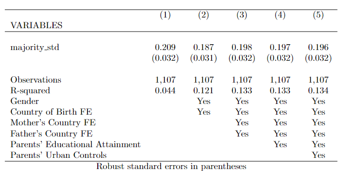
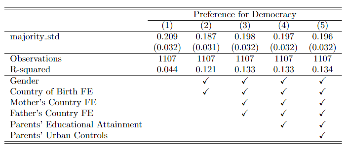
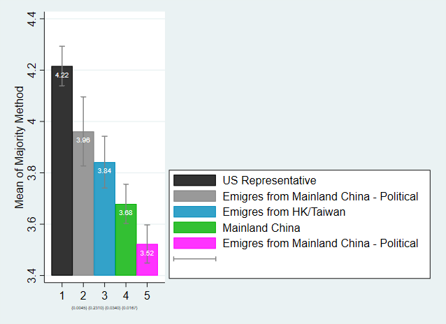
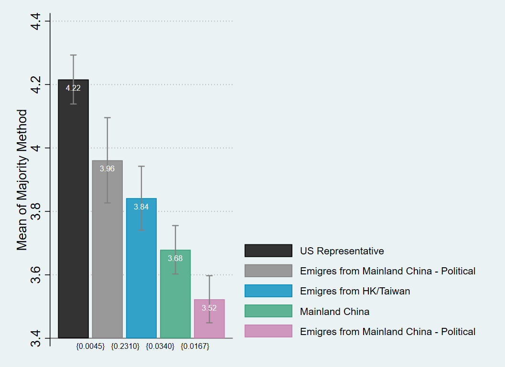

# 資料分析練習

## Table 1

### 變數設定
* `prefer_demo`:  Preference for Democracy (Y)
    * `prefer_demo_std`: Standardized Y
* `majority`: Majority Method (X)
    * `majority_std`: Standardized X
* `gender`: Gender (dummy)
* `country_of_birth`: Birth country
* `new_mother_country`: Mother's birth country
* `new_father_country`: Father's birth country
* `parents_education`: Parents’ Educational Attainment, a dummy variable for parents' education (high school or higher)
    * Q10ai: father's education
    * Q10bi: mather's education

* `parents_urban`: Parents’ Urban Controls (dummy)
    * Q24a: Father’s Urban Origin
    * Q23a: Mather’s Urban Origin
    
### 模型
> Model: 
```reghdfe Y X, vce(robust) absorb(FEs)```
* Y: `prefer_demo_std`
* X: `majority`
* 控制變數 (FE): `gender`, `country_of_birth`, `new_mother_country`, `new_father_country`, `parents_education`, `parents_urban`

### 表格輸出
```stata
reghdfe prefer_demo_std majority_std, vce(robust) absorb(gender country_of_birth new_mother_country new_father_country parents_education parents_urban)
outreg2 using table1.tex, append stats(coef se) bdec(3) sdec(3) addtext(Gender, Yes, Country of Birth FE, Yes, Mother's Country FE, Yes, Father's Country FE, Yes, Parents' Educational Attainment, Yes, Parents' Urban Controls, Yes) ctitle(" ") noaster nocons tex 
```

#### 原始輸出
```latex
\documentclass[]{article}
\setlength{\pdfpagewidth}{8.5in} \setlength{\pdfpageheight}{11in}
\begin{document}
\begin{tabular}{lccccc} \hline
 & (1) & (2) & (3) & (4) & (5) \\
VARIABLES &  &  &  &  &  \\ \hline
 &  &  &  &  &  \\
majority\_std & 0.209 & 0.187 & 0.198 & 0.197 & 0.196 \\
 & (0.032) & (0.031) & (0.032) & (0.032) & (0.032) \\
 &  &  &  &  &  \\
Observations & 1,107 & 1,107 & 1,107 & 1,107 & 1,107 \\
R-squared & 0.044 & 0.121 & 0.133 & 0.133 & 0.134 \\
Gender &  & Yes & Yes & Yes & Yes \\
Country of Birth FE &  & Yes & Yes & Yes & Yes \\
Mother's Country FE &  &  & Yes & Yes & Yes \\
Father's Country FE &  &  & Yes & Yes & Yes \\
Parents' Educational Attainment &  &  &  & Yes & Yes \\
 Parents' Urban Controls &  &  &  &  & Yes \\ \hline
\multicolumn{6}{c}{ Robust standard errors in parentheses} \\
\end{tabular}
\end{document}
```


#### 表格修改(使用latex)
```latex
\documentclass[]{article}
\usepackage{amssymb}
\setlength{\pdfpagewidth}{8.5in} \setlength{\pdfpageheight}{11in}

\begin{document}
\begin{tabular}{lccccc} \hline \hline
 & \multicolumn{5}{c}{Preference for Democracy} \\ \cline{2-6}
 & (1) & (2) & (3) & (4) & (5) \\ \hline
majority\_std & 0.209 & 0.187 & 0.198 & 0.197 & 0.196 \\
 & (0.032) & (0.031) & (0.032) & (0.032) & (0.032)\\ \hline
Observations & 1107 & 1107 & 1107 & 1107 & 1107 \\
R-squared & 0.044 & 0.121 & 0.133 & 0.133 & 0.134 \\ \hline 
Gender &  & \checkmark & \checkmark & \checkmark & \checkmark \\
Country of Birth FE &  & \checkmark & \checkmark & \checkmark & \checkmark \\
Mother's Country FE &  &  & \checkmark & \checkmark & \checkmark \\
Father's Country FE &  &  & \checkmark & \checkmark & \checkmark \\
Parents' Educational Attainment &  &  &  & \checkmark & \checkmark \\
Parents' Urban Controls &  &  &  &  & \checkmark \\ \hline \hline

\end{tabular}
\end{document}
```


## Appendix A.11 
### 變數設定
* `majority`: Majority Method (from trhee different resources)
* `prefer_demo`: Preference for Democracy (Q30) --不考慮Q30回答不知道者
* `prefer_demo_q`: Preference for Democracy (q24) --不考慮q24回答不知道者
* `political`: 是否將「政治自由」列為移民考慮因素 (Q25_22) --dummy
### 模型
>  The p-value of a test that the average preference for Majority Method is the same in each case
```stata
ttest var1 == var2, unpaired
scalar p_i = r(p)
```
> The confidence intervals of each of those averages at the 90% level.
```stata
gen category = .
replace category = 1 if !missing(majority_us)
replace category = 2 if !missing(majority_pol)
replace category = 3 if !missing(majority_hkt)
replace category = 4 if !missing(majority_ch)
replace category = 5 if !missing(majority_nonpol)
statsby mean_majority=r(mean) upper=r(ub) lower=r(lb), level(90) by(category) clear : ci mean majority
```

### 作圖
#### 原始Stata作圖
```stata
twoway (bar 1) (bar 2) (bar 3) (bar 4) (bar 5) ///	
       (rcap lower upper category) ///
       (scatter mean_majority category)
```


#### 使用Grapher Editor進行調整

